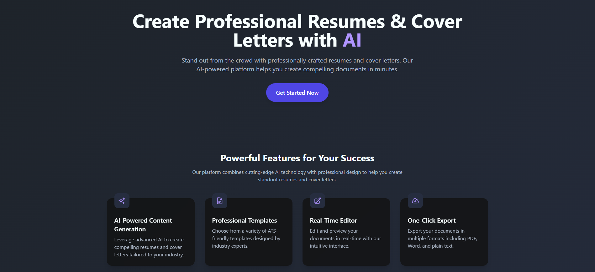
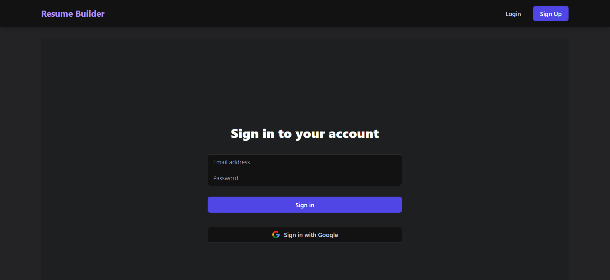
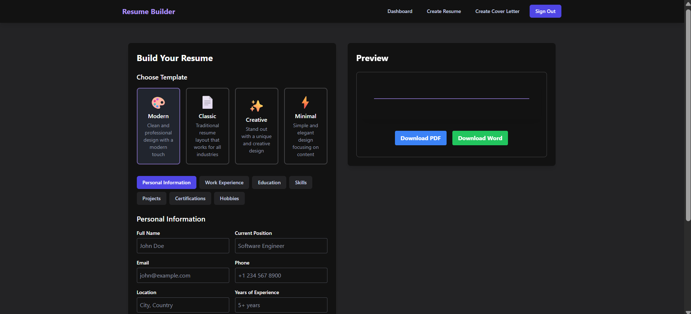
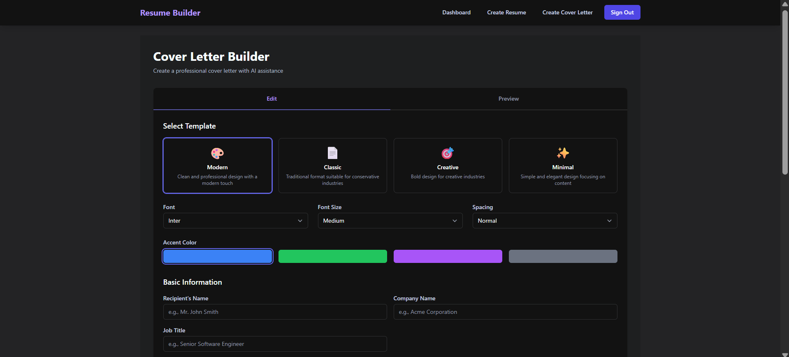

# 🧠 AI Resume & Cover Letter Builder

An AI-powered web application that helps users generate personalized resumes and cover letters using cutting-edge NLP models. Built with React.js, Firebase Authentication, Express.js, and the Hugging Face API, this tool streamlines the job application process with just a few clicks.

---

## 🚀 Features

- ✍️ **AI-Powered Cover Letter Generator** – Uses Hugging Face API to generate personalized content.
- 📄 **Smart Resume Suggestions** – Bullet points tailored to job descriptions.
- 👤 **Secure Login** – Firebase Authentication with Google and Email/Password.
- ⚛️ **Modern UI** – Built with Vite + TailwindCSS for blazing-fast frontend.
- 🧑‍💻 **Express.js Backend** – Manages API routing, auth, and middleware.
- 📝 **Export Options** – Download resumes and letters as PDF (coming soon).
- 💡 **Client-side Validation** – Prevents blank inputs and handles edge cases.
- 📍 **Runs Locally** – Not deployed yet; works via `localhost`.

---

## 🧰 Tech Stack

| Layer       | Technology                            |
|-------------|----------------------------------------|
| Frontend    | React.js, Vite, TailwindCSS            |
| Backend     | Node.js, Express.js                    |
| AI/ML       | Hugging Face Transformers API          |
| Auth        | Firebase Authentication                |
| State Mgmt  | React Context API                      |
| Hosting     | Not deployed (local only)              |

---

## 📸 Screenshots






## 🛠️ Getting Started (Local Setup)

Follow these steps to run the project locally on your machine.

---

### 1. Clone the Repository

```bash
git clone https://github.com/your-username/AI-Resume-Cover-Builder.git
cd AI-Resume-Cover-Builder

### 2. Install Dependencies

```bash
npm install


### 3. Create .env File
Create a .env file in the root folder and add the following:

```env
VITE_FIREBASE_API_KEY=your_api_key
HUGGINGFACE_API_KEY=your_huggingface_api_key
🔒 Note: Never upload this .env file to GitHub. Make sure it's included in .gitignore.

### 4. Start Development Server

```bash
npm run dev
```

Your app will run at:
http://localhost:5173


✅ Just replace:
- `your-username` with your actual GitHub username
- Replace the API key placeholders

📄 License
This project is licensed under the MIT License.

🙋‍♀️ Contributing
Pull requests are welcome! Please open an issue first to discuss changes or ideas.
